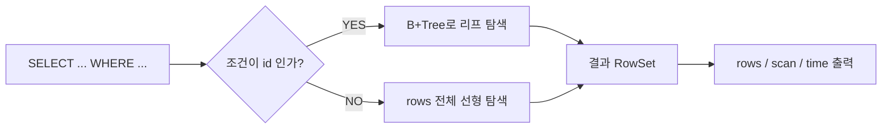
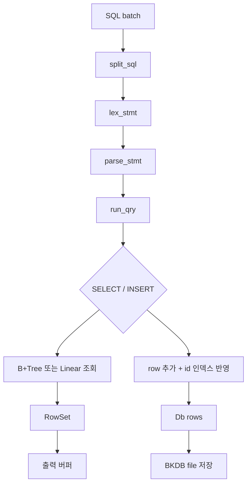
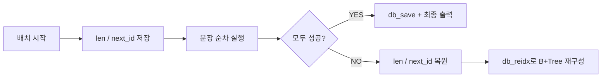

# B+Tree SQL 데모

> `books` 단일 테이블을 대상으로,  
> `id` 조건은 **B+Tree**, 그 외 조건은 **Linear Scan**으로 처리하는 미니 SQL 엔진입니다.

---

## 핵심 요약

| 내용 |
| --- |
| `SELECT`, `INSERT`, 배치 실행, 롤백, 바이너리 저장 |
| `WHERE id = ...`, `WHERE id BETWEEN ... AND ...`는 B+Tree 사용 |
| **같은 1,000건 조회도 B+Tree가 Linear보다 약 4,900배 빠름** |

### 성능 하이라이트

| 쿼리 | rows | scan | time |
| --- | ---: | --- | ---: |
| `WHERE id = 1000000` | 1 | `B+Tree` | `0.001 ms` |
| `WHERE id BETWEEN 999001 AND 1000000` | 1000 | `B+Tree` | `0.021 ms` |
| `WHERE author = 'Author 999'` | 1000 | `Linear` | `103.440 ms` |

> 같은 `1000건` 결과 기준으로 보면  
> `id BETWEEN` 조회는 `author` 선형 탐색보다 약 `4,925x` 빠릅니다.

---

## 왜 빨라지는가

- `id = n`은 B+Tree 단건 조회
- `id BETWEEN a AND b`는 B+Tree 리프 링크 범위 조회
- `author`, `genre`, `title`, 전체 조회는 선형 탐색

---

## 처리 흐름

### 지원 문법

- `SELECT * FROM books;`
- `SELECT * FROM books WHERE id = 3;`
- `SELECT * FROM books WHERE id BETWEEN 10 AND 20;`
- `SELECT title,genre FROM books WHERE author = 'George Orwell';`
- `INSERT INTO books VALUES ('Book','Author','Genre');`

---

## 실패해도 안전한 이유

- 출력은 바로 찍지 않고 버퍼에 모아 둡니다.
- 실패하면 `len`, `next_id`를 되돌리고 B+Tree를 다시 만듭니다.
- 저장은 `.tmp` 파일 교체 방식이라 부분 저장 위험을 줄였습니다.

---
