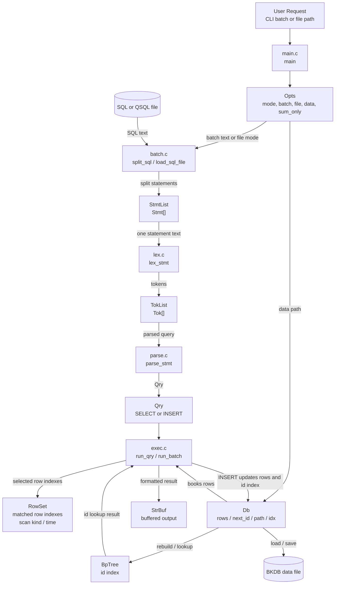
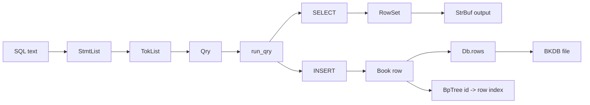
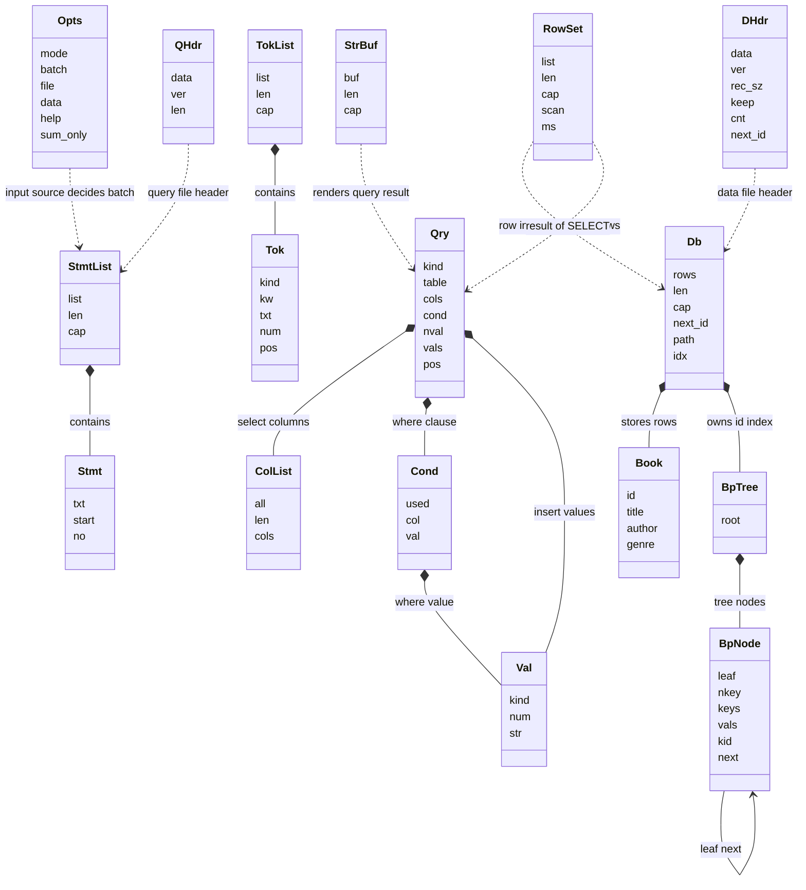

# 클래스 다이어그램과 요청 흐름

이 문서는 `books` SQL 데모가 사용자 요청을 어떻게 받아서 처리하는지, 각 구조체가
어떻게 연결되는지, 그리고 어떤 데이터를 주고받는지 한 번에 보이도록 다시 정리한
그림이다.

## 요청 처리 흐름

## 핵심 데이터 이동

## 구조체 관계

## 읽는 순서

1. 사용자 요청이 `Opts`로 정리되고 `StmtList -> TokList -> Qry`로 바뀌는 흐름을 본다.
2. `Qry`가 `run_qry`로 들어가서 `SELECT`면 `RowSet`, `INSERT`면 `Db` 변경으로 가는
   흐름을 본다.
3. `Db`가 `Book[]`와 `BpTree`를 함께 들고 있고, 저장 시 `DHdr + row data`로 파일에
   기록된다는 점을 본다.

## 핵심 해석 포인트

- 사용자 입력의 중심 데이터는 `SQL text`이고, 실행 직전의 중심 데이터는 `Qry`다.
- 조회 실행의 중심 데이터는 `RowSet`이다. 실제 `Book` 복사본이 아니라 행 인덱스와
  탐색 요약을 담는다.
- 저장 계층의 중심 데이터는 `Db`다. 메모리 캐시 `rows`와 `id` 전용 인덱스 `BpTree`
  를 함께 관리한다.
- 파일 계층은 두 종류다.
  `QHdr`는 `QSQL` 배치 파일용, `DHdr`는 `BKDB` 데이터 파일용이다.
